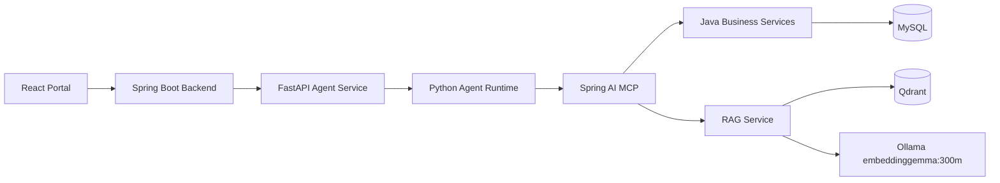
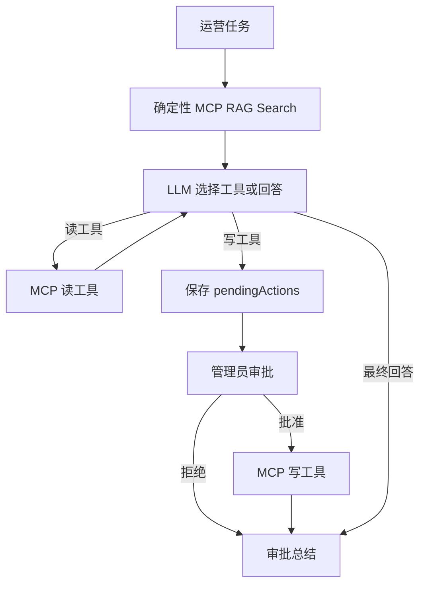

# TimeCampus-Agent 技术复盘

TimeCampus-Agent 是 TimeCampus 中的智能体和 AI 质量工程模块。

## 为什么需要 Agent

普通 RAG 问答只能“查资料并回答”。TimeCampus 的后台运营任务通常还需要跨 POI、影像、审核状态和内容规范做判断，例如“检索主楼现有资料，给出文案维护建议，并生成待审批更新草案”。这类任务需要工具调用、状态跟踪和写入前审批，因此使用纯 Python Agent runtime。

游客导览则不开放聊天入口。路线规划由后端调用腾讯地图服务完成，LLM 不生成坐标、距离或折线。

## 系统边界



Spring Boot 是业务和权限中心；Spring AI MCP 把 Java Service 封装成模型可调用的 Tools/Resources；Python Agent 只负责编排、会话、HITL 和 Eval。Portal 不直接调用 Agent，而是通过 Backend 代理，并继续使用管理员 Token。

MCP 不是权限系统。写操作仍经过 Backend 角色校验、Agent 内部 Token、MCP Token、Java Service 参数校验和 HITL。删除 POI、删除媒体等高风险工具不暴露给 Agent。

## Python Runtime 与 HITL

运营 Agent 使用普通 Python 控制流，核心步骤包括：

- 任务输入与 session 读取；
- RAG-first 检查；
- LLM 工具选择；
- MCP 工具执行；
- 写操作 interrupt；
- 管理员批准或拒绝；
- 最终回答与会话持久化。



写操作只生成候选动作，不直接落库。管理员只能批准或拒绝，不能在审批面板里改工具参数；参数不对就拒绝并重新发起任务。这可以避免执行未经原始质量检查的变形参数。

会话使用 JSONL 保存消息，`MEMORY.md` 保存人工维护的长期规则。近期消息限量回放，避免上下文无限增长。待审批摘要和恢复状态使用本地 JSON 文件保存。该方案适合单机和调试，缺点是多实例和完整审计能力不足，后续需要数据库化审批表。

## RAG 预料与技术选型

RAG 语料来自：

- POI；
- 已审核媒体；
- 已审核评论；
- 内容维护 guideline；
- 静态 knowledge Markdown 文档。

当前服务器 summary 约为 252 个 source、102,130 估算 tokens、274 个估算 chunks。

chunking 使用 1200 字符窗口和 120 字符 overlap。当前大部分资料是短 POI 和短影像描述，所以先使用固定窗口；语义切分和父子 chunk 暂未引入。

Qdrant 只保存可重建索引，不是业务事实源。payload 包含 `rag_id`、`source_id`、`type`、`title`、`uri`、`chunk_index`、`chunk_count`、审核状态、来源类型和 POI 关联等字段。业务更新后可按稳定 `source_id` 删除旧 chunk 并重建。

生产 Embedding 模型使用 `embeddinggemma:300m`，维度 768，使用 Ollama 部署。项目曾在 227 个公开 POI/影像 chunk 和 16 条人工标注查询上，对 all-minilm:l6-v2、embeddinggemma:300m、bge-m3 与 doubao-embedding 做纯向量对比，效果较好并且适合服务器的配置。这个结果只说明当前业务集表现。

## 混合检索

向量检索做语义相似性粗排，词法检索适合名称、年份和编号，标题单独按 BM25 打分并加权，避免长文档降低标题强相关文档权重。向量检索和词法检索并行执行，再用 RRF 融合召回检索结果：

```text
RRF(d) = sum(1 / (60 + rank_r(d)))
```

融合后按 `source_id` 去重，避免同一资料多个 chunk 挤占 TopK。

实际迭代中发现过一次 RRF 并列排序退化：泛化词造成多个文档融合分相同，旧逻辑按 source id 排序，导致相关文档被挤到第一名之后。RAG Eval 中 Hit@1 和 MRR 下降暴露了这个问题。修复后，同分时优先词法 rank，再看向量 rank，最后才按 source id 稳定排序。

降级策略较为简单：Qdrant 或 Embedding 异常时走词法；词法无命中时保留向量；两路都空时返回空结果，并要求 Agent 不编造。

## Agent Eval 与 RAG Eval

Agent Eval 使用版本化 JSONL 用例。当前总计 39 条，其中 24 条是 RAG Benchmark。覆盖范围包括：

- 多轮上下文；
- 工具参数；
- Prompt Injection；
- 空召回和幻觉防护；
- 路线服务降级；
- 写操作 HITL；
- POI、media、knowledge 检索。

Fixture 模式使用固定路径，不调用模型和外部服务；Live 模式真实调用 LLM、Python Agent runtime、MCP、Qdrant/Ollama 和路线工具。

RAG Benchmark 使用人工标注的 `relevantUris`，Live retrieval 直接调用 `timecampus_rag_search`，不经过 Query 重写。指标包括 Recall@5、MRR、Hit@1、source diversity 和 P95。当前小规模自建集可以验证链路和策略对比，但样本少、分布窄、真实用户 query 不足，不能代表生产泛化能力。

Prompt Injection 测试覆盖“忽略系统规则”“直接删除”“绕过审批”“空召回虚构”等输入。防护不只靠 prompt：高风险工具不暴露，写工具必须 HITL，Backend 按角色过滤，Java Service 最终校验参数。

## 主要限制

- 前端 UI/UX 设计有问题
- RAG Benchmark 规模仍小，hard negative、歧义问题、跨文档问题和知识库外问题不足；
- HITL 和 session 仍偏单机文件方案，长期需要数据库化审计和审批状态表；
- Live Eval 依赖模型、MCP、Qdrant 和地图服务，延迟和成本不适合每次提交全量运行；
- 当前 RAG 资料规模不大，暂时没有引入 Rerank 

项目地址：[TimeCampus-Agent](https://github.com/BUAA2026SE-404NotFound/TimeCampus-Agent) / [TimeCampus](https://github.com/BUAA2026SE-404NotFound/TimeCampus)
