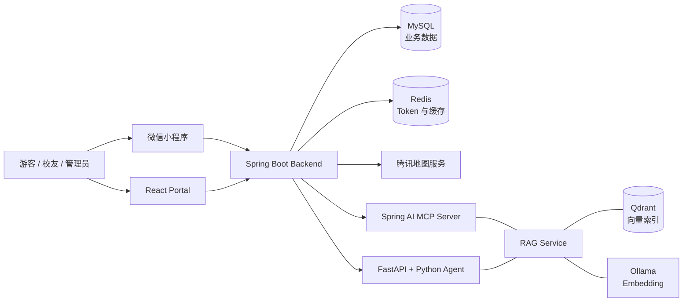

# TimeCampus 技术架构复盘

TimeCampus（时光航迹）是一个面向校园历史影像展示、游客导览和内容运营的系统。它以校园 POI 为空间索引，以年份和影像资料为时间线索，将官方历史影像、用户投稿、评论和地点资料组织为可浏览、可检索、可审核的数据。

项目从“校园时光机地图”的 MVP 开始，Alpha 阶段形成 Spring Boot 后端、MySQL、管理端和小程序方案。由于公开访问、地图展示和管理工作台需要更稳定的 Web 入口，后续补充 React Portal，并在 Beta 后期接入 Spring AI MCP 与纯 Python Agent。当前项目仍是持续迭代状态。

## 系统边界

系统没有让 Agent 直接访问数据库。Spring Boot 仍然是业务事实源和权限中心，负责 POI、媒体、评论、审核、文件访问、路线代理和管理员鉴权。Python Agent 只通过 Backend 代理和 MCP 工具调用已有业务能力。

这条边界的核心原因是：数据库写入、权限、审核状态、文件访问和地图路线都必须是确定性业务逻辑；LLM 只适合做检索、归纳、任务拆解和候选动作生成。

## 后端与数据选型

Backend 使用 Spring Boot 多模块组织 controller、service、repository、security、mcp、rag 和 agent proxy 等职责。MySQL 保存 POI、媒体、评论、用户、管理员和审核状态；Qdrant 只保存可重建的向量索引，不作为事实源。

RAG 语料来自 POI、已审核媒体、已审核评论、内容维护规范和网络上搜集到的和校史馆提供的静态 knowledge Markdown 文档。当前服务器语料约 252 个 source，估算 102,130 tokens。chunking 使用 1200 字符窗口和 120 字符 overlap。这个设置偏简单，但符合当前资料以短 POI 和短影像描述为主的特点；语义切分、父子 chunk 和 reranker 只有在评测集扩大后证明必要时再加入。

向量检索使用 Qdrant，Embedding 生产环境使用 `embeddinggemma:300m`。选择依据结合服务器配置限制、MTEB 排名与本项目的实际数据构成的小规模测试集。该结论只说明当前场景内表现，不代表通用中文检索能力。

## Portal 与地图

Portal 使用 Codex 开发，技术栈大致为 React、TypeScript、Vite、Tailwind 和 shadcn/ui。

## Agent 接入原则

Agent 主要用于后台运营和质量评测。Spring AI MCP 将 Java Service 暴露为 Tools/Resources，Python runtime 负责工具调用顺序、RAG-first 约束和 HITL。创建、更新、导入、审核、索引等写操作都需要人工审批；删除 POI 和删除媒体工具不暴露给 Agent。

Agent、RAG、Embedding、MCP、HITL、Eval 的详细设计见 [TimeCampus-Agent 技术复盘](./TimeCampus_Agent_Retrospective.md)。

## 部署与运维

生产环境采用单机部署：

- Nginx：公网入口与前端构建的静态资源；
- systemd：Backend 与 Agent；
- Docker Compose：Qdrant、Ollama、Captcha 和 Redis；
- GitHub Actions：通过 CI 后触发部署；
- 服务器拉取精确 Git SHA 后本地构建；
- 发布失败时恢复旧 jar、旧 Agent release 或旧 Portal dist。

## 主要限制

当前系统仍有几个明确限制：

- RAG Benchmark 仍是小规模自建集，适合回归和策略对比，不代表真实用户泛化能力；
- Agent 审批和会话记忆仍以单机文件与轻量持久化为主，多实例和完整审计能力不足；
- Agent 能力较为基础，不支持 Multi-Agent
- RAG 没有进行 Rerank
- UI/UX 有很大问题
- Redis、Agent Token、MCP Token、地图 Key 等配置复杂，需要持续做一致性校验。
- 单机部署，带宽超低

项目地址：[GitHub](https://github.com/BUAA2026SE-404NotFound/TimeCampus) / [在线站点](https://www.timecampus.asia)
